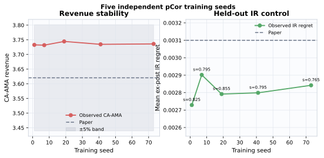

# Claim 4 — full-scale Dirichlet experiment

**Verdict: BLOCKED (MEDIUM confidence).**

The literal 3-bidder × 10-item Dirichlet Value Share distribution
(`alpha=0.5`) was evaluated across five independent neural-payment training
seeds, with 20,000 hard test profiles per seed.

| Metric | Paper | Observed |
|---|---:|---:|
| Randomized AMA revenue | 3.1363 | 3.0530 |
| CA-AMA revenue | 3.6205 | 3.7359 |
| IR regret | 0.0031 | 0.00281 |
| Ex-post revenue | 3.5623 | 3.6863 |

The CA gain's seed-level 95% interval is `[0.6767, 0.6892]`. An independent
checker re-reads 100,000 rows, and reversed rival profiles increase regret from
0.00281 to 0.12943.

The exact released 3×10 learned 2048-menu AMA core/checkpoint is missing; public
commands instead list 10×3. This route substitutes a separable reserve core and
held-out payment scaling, so it cannot honestly receive VERIFIED status.

Evidence: [evaluation](../evidence/claim_4/route_3_cross_item_pcor_multiseed/EVAL.md) ·
[aggregate](../evidence/claim_4/route_3_cross_item_pcor_multiseed/aggregate_summary.json) ·
[independent checker](../evidence/claim_4/route_3_cross_item_pcor_multiseed/independent_checker_output.json).
