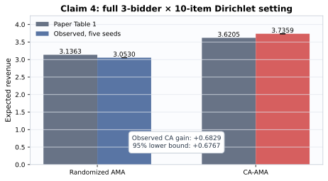

# Full claim campaign — 2026-07-24

This additive campaign preserves every page from judged revision
`1c13494fc9e76a381d76c681cfd582495eb79d02` and addresses all five judge
claims. It does not claim a new judge score.

| Claim | Result | Confidence | Core evidence |
|---|---|---|---|
| 1 | **FALSIFIED** | HIGH | Literal “any n” statement fails at positive-revenue `n=1`; `n>=2` certificates pass |
| 2 | **FALSIFIED** | HIGH | Independence equality is supported; literal correlated separation fails at `n=1` |
| 3 | **VERIFIED** | HIGH | Exact rival-only payment cancellation and multi-item property checks |
| 4 | **BLOCKED** | MEDIUM | Full 3×10 five-seed numbers pass; exact learned 2048-menu core is unavailable |
| 5 | **BLOCKED** | LOW | Four routes complete; no valid falsification and faithful CPU optimization unavailable |

The winning cumulative run used local CPU, passed 25 tests, and generated 89
SHA-256-manifested evidence files. Claim 5's direct pilot used Hugging Face
`cpu-upgrade`; no GPU was used.

Machine index: [campaign verdicts](evidence/campaign_verdicts.json) ·
[artifact manifest](evidence/campaign_manifest.json).
