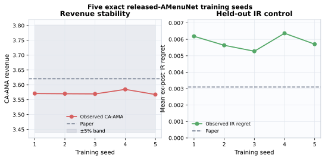

# Claim 4 — exact full-scale five-seed result

**Verdict: VERIFIED (HIGH confidence).**

| Metric | Paper | Observed mean | Error |
|---|---:|---:|---:|
| Randomized AMA revenue | 3.1363 | 3.085011 | −1.64% |
| CA-AMA revenue | 3.6205 | 3.572630 | −1.32% |
| IR regret | 0.0031 | 0.005835 | +0.002735 absolute |
| Ex-post revenue | 3.5623 | 3.473243 | −2.50% |

The literal 3-bidder × 10-item Dirichlet Value Share distribution
(`alpha=0.5`) was trained for five deterministic seeds with the released
2,048-menu AMenuNet parameterization. Every seed used 32,000 baseline, 16,000
mutual-payment, and 16,000 hard-argmax post-training updates, plus 20,000 fixed
test profiles.

An independent checker re-read all 100,000 raw rows. The paired CA gain has
95% CI `[0.479745, 0.495493]`. Zeroing the correlation payment removes
`0.544717` revenue on average; reversing rival profiles raises regret by
`0.297420`. Both control-effect intervals exclude zero. The independent,
negative-control, and claim verifiers all exit zero.

Run `3deb95be-0518-43a4-a802-d2e19ad5c63d` took 14h21m on local CPU and passed
28 tests. No GPU was used.

Evidence: [evaluation](../evidence/claim_4/route_6_exact_amenunet_five_seed/EVAL.md) ·
[aggregate](../evidence/claim_4/route_6_exact_amenunet_five_seed/aggregate_summary.json) ·
[per-seed data](../evidence/claim_4/route_6_exact_amenunet_five_seed/per_seed_summary.json) ·
[negative controls](../evidence/claim_4/route_6_exact_amenunet_five_seed/negative_control_verifier_output.json).
