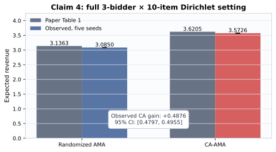

# Claim 4 exact five-seed verification — 2026-07-25

This additive update preserves the judged revision
`1c13494fc9e76a381d76c681cfd582495eb79d02` and the previously published
revision `615386b5740671c4481b076588c796192449516a`.

| Claim | Result | Confidence | Core evidence |
|---|---|---|---|
| 1 | **FALSIFIED** | MEDIUM | Literal `n=1` statement fails; intended `n≥2` certificates pass |
| 2 | **FALSIFIED** | MEDIUM | Literal one-bidder separation fails; intended identities pass |
| 3 | **VERIFIED** | HIGH | Exact rival-only cancellation and multi-item checks |
| 4 | **VERIFIED** | HIGH | Exact five-seed AMenuNet run, 100,000 raw rows, all fail-closed checks pass |
| 5 | **BLOCKED** | LOW | Four required routes complete; no valid falsification |

Claim 4 observed randomized-AMA revenue `3.085011` and CA-AMA revenue
`3.572630`, versus paper values `3.1363` and `3.6205`. Its paired gain is
`0.487619`, with seed-level 95% CI `[0.479745, 0.495493]`.

This is reproduction evidence, not a live-judge score. Previous judged score:
`3/10`. Conservative forecast: `6–8/10`; best-supported possible score:
`8/10`, forecast only.

Evidence: [Claim 4 evaluation](evidence/claim_4/route_6_exact_amenunet_five_seed/EVAL.md) ·
[contract](evidence/claim_4/route_6_exact_amenunet_five_seed/claim_contract.json) ·
[independent checker](evidence/claim_4/route_6_exact_amenunet_five_seed/independent_checker_output.json) ·
[cumulative verdict index](evidence/campaign_verdicts.json).
