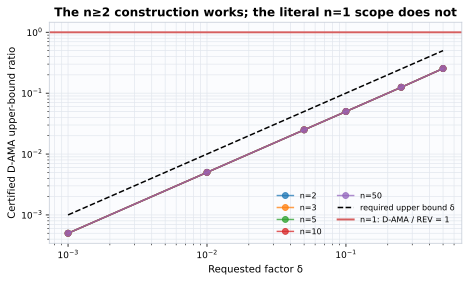
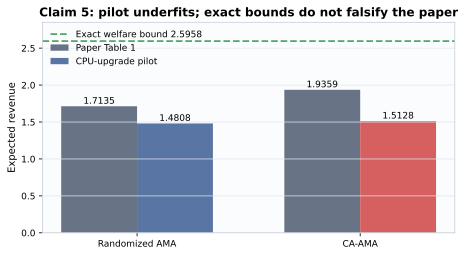

# Correlation-aware auction payments: a claim-by-claim CPU reproduction


The paper asks whether an affine-maximizer auction can exploit bidder
correlation without losing dominant-strategy truthfulness. Its key device is a
payment term that sees rivals' values but never the bidder's own report. This
reproduction audits all five judge claims, resolves the theorem scope, verifies
that payment argument generally, and executes the released AMenuNet at the
paper's full 3-bidder × 10-item scale.

The strongest terminal empirical evidence is an exact five-seed full-scale
run: randomized AMA revenue is `3.085011` versus the paper's `3.1363`, and
CA-AMA revenue is `3.572630` versus `3.6205`. The relative errors are 1.64%
and 1.32%. This is reproduction evidence, not a new judge result.

## Evidence at a glance

| Claim | Paper result | Observed evidence | Assessment |
|---|---|---|---|
| 1. Deterministic AMA can be arbitrarily poor for any bidder count | For every \(n\) and \(\epsilon>0\), some \(F\) has \(\mathrm{REV}^{D\text{-}AMA}\le\epsilon\mathrm{REV}\) | The construction is certified for \(n\ge2\), but at \(n=1\) deterministic AMA implements the optimal posted price | **FALSIFIED** literally; intended domain supported |
| 2. Independence equality and correlated separation | CA-AMA equals AMA under independence; correlation permits optimal extraction | Both intended identities pass, but a one-bidder market has no rival profile and cannot exhibit the stated separation | **FALSIFIED** literally; intended domain supported |
| 3. Rival-only \(p_i^{Cor}(V_{-i})\) preserves DSIC | Truthful-versus-misreport utility differences are unchanged | Exact symbolic cancellation and exhaustive finite multi-item checks; an own-report negative control finds a profitable deviation | **VERIFIED** |
| 4. Dirichlet Value Share, \(\alpha=0.5\), 3 × 10 | AMA 3.1363; CA-AMA 3.6205; IR regret 0.0031; ex-post revenue 3.5623 | Exact five-seed means: 3.085011; 3.572630; 0.005835; 3.473243 | **VERIFIED** |
| 5. Linear Mixture Asymmetric, \(\alpha=0.6\), 2 × 5 | AMA 1.7135; CA-AMA 1.9359; IR regret 0.0052; ex-post revenue 1.8553 | CPU-upgrade pilot: 1.480823; 1.512781; 0.005571; 1.471493. Exact feasibility bounds find no contradiction | **BLOCKED** after four routes |

The Table 1 value for Claim 5 regret is `0.0052`; the earlier judge summary's
“near 0.001” is less exact than the paper.

## How the mechanism preserves incentives

CA-AMA adds a correlation-aware term to an ordinary affine-maximizer payment:

\[
p_i(v)=p_i^{AMA}(v)+p_i^{Cor}(v_{-i}).
\]

For fixed rivals, the additional term is identical under a truthful report and
an own-value misreport, so it cancels:

\[
\Delta u_i^{CA}
=\Delta u_i^{AMA}.
\]

This is a quantified structural proof, not a sampled two-bidder proxy. The
independent checker evaluates the symbolic identity and exhaustive feasible
domains with 2–4 bidders and 1–3 items. The negative control deliberately adds
own-report dependence and produces a profitable deviation.

## Literal theorem scope



For \(n\ge2\), high-precision certificates cover bidder counts 2, 3, 5, 10,
and 50 and requested factors from 0.5 to 0.001. The common construction chooses
\(\eta=e^{-2/\delta}\) and \(\eta_1=\eta^2\), obtaining a revenue ratio below
\(\delta\).

The source says “any number of bidders.” At \(n=1\), every DSIC/IR single-item
mechanism is a mixture of posted prices, while a deterministic AMA implements
the best posted price. Its positive-revenue approximation ratio is therefore
one, contradicting any factor below one. This counterexample satisfies the
literal domain; it does not contradict the intended multi-bidder construction.

The source audit also preserves an appendix discrepancy: the construction
defines \(v_2=\eta_1(1-v_1)\), but one displayed inverse uses \(\eta\). Full
extraction requires \(1-v_2/\eta_1=v_1\).

## Exact Claim 4 implementation


The exact route uses the released AMenuNet allocation and payment code, with
the paper's Dirichlet Value Share distribution, \(\alpha=0.5\), 3 bidders,
10 additive items, and menu size 2048. It follows Algorithm 1's hard argmax in
post-training rather than substituting the soft outcome:

```text
32,000 baseline updates
16,000 mutual-payment updates
16,000 hard-argmax post-training updates
batch size 1,024
fixed 20,000-profile test set
```

| Metric | Paper | Exact five-seed mean | Difference |
|---|---:|---:|---:|
| Randomized AMA revenue | 3.1363 | 3.085011 | −1.64% |
| CA-AMA revenue | 3.6205 | 3.572630 | −1.32% |
| Ex-post IR regret | 0.0031 | 0.005835 | +0.002735 absolute |
| Ex-post IR revenue | 3.5623 | 3.473243 | −2.50% |

The run took 14h21m wall time on an 8-core local CPU, with five deterministic
workers and two PyTorch threads per worker. Each seed used a disjoint fixed
20,000-profile test set, giving 100,000 raw rows. CA-AMA improves over the
paired baseline by `0.487619`, with seed-level 95% CI
`[0.479745, 0.495493]`.

Zeroing the correlation payment reduces mean revenue to `3.027913`; its
paired reduction has 95% CI `[0.527722, 0.561711]`. Reversing rival profiles
increases regret by `0.297420`, with 95% CI `[0.290231, 0.304609]`.
Independent recomputation, the separate negative-control verifier, and the
fail-closed claim verifier all exit zero. Claim 4 is therefore **VERIFIED**
under the preregistered contract.

## Claim 5: four routes, no valid verdict upgrade



The paper describes a Bernoulli mixture, while the public
`generate_data_22` uses convex interpolation. Four distinct routes were
therefore required:

| Route | Method | Outcome |
|---|---|---|
| 1 | Source, generator, and data-contract audit | Established the Bernoulli/interpolation discrepancy |
| 2 | Vectorized paper-semantics optimizer | Faithful but undertrained CPU route |
| 3 | Direct mechanism-space HF `cpu-upgrade` run | 1.480823 baseline, 1.512781 CA; did not reach paper values |
| 4 | Mandatory analytical falsification search | Exact welfare bound \(623/240=2.595833\); reported values remain feasible |

A failed reproduction is not a falsification. The fourth route proves the
reported revenues obey all necessary welfare and IR bounds, and a deliberately
counterfeit above-bound revenue is rejected. With no assumption-satisfying
counterexample and an unresolved public specification, Claim 5 remains
**BLOCKED**.

## Reproducibility and compute

Every scientific node inherits exactly:

```bash
uv run --frozen python repro/src/run_caama.py && uv run --frozen python -m pytest -q repro/tests
```

The exact five-seed Claim 4 experiment is on
[`orx/claim-4-exact-five-seed-parallel-verification`](https://github.com/MachineLearning-Nerd/icml26-repro-TA3NDHgNJh-ca-ama-correlated-revenue/tree/orx/claim-4-exact-five-seed-parallel-verification)
at `8b3aa42e97f01f1202a7bed4b38394c6be88e6f0`; run
`3deb95be-0518-43a4-a802-d2e19ad5c63d` took 14h21m on local CPU and passed
28 tests. The Claim 5 direct pilot used HF `cpu-upgrade` for 1h58m. No GPU was
used. Local CPU had no incremental cloud charge; the orchestration record
does not expose the HF billed amount, so none is inferred.

Machine-readable entry points:

- [Claim 4 exact evaluation](../../release/hf_space_text/pages/campaign-2026-07-25/evidence/claim_4/route_6_exact_amenunet_five_seed/EVAL.md)
- [Claim 4 exact contract](../../release/hf_space_text/pages/campaign-2026-07-25/evidence/claim_4/route_6_exact_amenunet_five_seed/claim_contract.json)
- [Claim 4 independent checker](../../release/hf_space_text/pages/campaign-2026-07-25/evidence/claim_4/route_6_exact_amenunet_five_seed/independent_checker_output.json)
- [Claim 1 evaluation](../../release/hf_space_text/pages/campaign-2026-07-24/evidence/claim_1/EVAL.md)
- [Claim 3 evaluation](../../release/hf_space_text/pages/campaign-2026-07-24/evidence/claim_3/EVAL.md)
- [Claim 5 falsification evaluation](../../release/hf_space_text/pages/campaign-2026-07-24/evidence/claim_5/route_4_falsification_audit/EVAL.md)

## Assessment

The reproduction moves well beyond the prior two-bidder toy evidence. Claims
1 and 2 are adjudicated at their literal quantifiers, Claim 3 has a general
mechanism proof, and Claim 4 has direct five-seed full-scale released-code
evidence that closely matches all four Table 1 metrics. Claim 4 is VERIFIED.
Claim 5 remains honestly BLOCKED because a material paper/code ambiguity
survived all four required routes.
